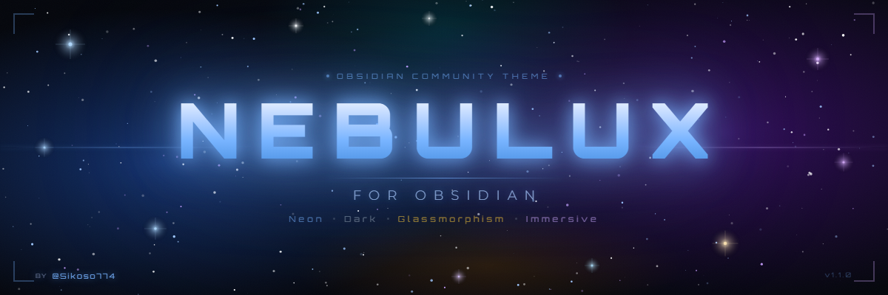
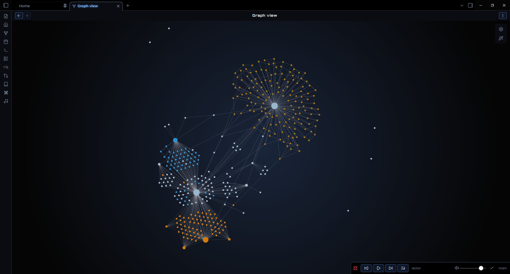

<div align="center">

</div>
<br>
<br>
<div>
  <p>
    
    
    
    
  </p>
</div>

<div align="center">

</div>

<br>
<br>

## Table of Contents

- [Table of Contents](#table-of-contents)
- [Key Features](#key-features)
- [Custom Callouts](#custom-callouts)
  - [🛠️ Icon Modifiers](#️-icon-modifiers)
  - [🔲 Clean Mode](#-clean-mode)
  - [💠 Native Mode](#-native-mode)
- [Building Dashboards](#building-dashboards)
  - [Method 1: The Flexbox Menu (No frontmatter required)](#method-1-the-flexbox-menu-no-frontmatter-required)
  - [Method 2: The Classic Full-Page Dashboard Grid](#method-2-the-classic-full-page-dashboard-grid)
- [Typography \& Offline Use](#typography--offline-use)
- [Installation \& Configuration](#installation--configuration)
- [Acknowledgements \& Credits](#acknowledgements--credits)

<br>
<br>

## Key Features

- 🖥️ **Sci-Fi Cockpit:** Darkened interface, futuristic fonts, and neon glow effects for optimal contrast.
- 🔠 **Gradient Headers (H1-H6):** Dynamic headers with unique gradients (Stellar Glow, Neon Nav, Status Energy, etc.) to elegantly hierarchy your notes.
- 🌫️ **Glassmorphism:** Dynamic transparency and background blur on active tabs and floating menus.
- 📁 **Dynamic File Explorer:** Built-in "Rainbow Folders" effect to automatically colorize and visually differentiate your folders.
- ⚙️ **Highly Customizable:** Full support for the *Style Settings* plugin.

<br>
<br>

## Custom Callouts

The theme features a custom callout system tailored to structure your dashboards, based on a strict design language. Use these to visually organize your data.

| Syntax | Render | Usage |
| :--- | :--- | :--- |
| `> [!nav]` | 🧭 **Neon Blue** | Navigation, Table of Contents, Dashboards. |
| `> [!status]` | 📊 **Tactical Gold** | Tasks, Validations, Project Status. |
| `> [!projects]`| 🚀 **Tactical Bronze**| Ideas, Ongoing projects, Warnings. |

### 🛠️ Icon Modifiers
You can swap the default callout icon on the fly by adding a keyword after a slash `/`.

| Keyword | Icon | Example |
| :--- | :---: | :--- |
| `idea` | 💡 | `> [!projects/idea]` |
| `brain` | 🧠 | `> [!projects/brain]` |
| `bug` | 🐞 | `> [!status/bug]` |
| `target` | 🎯 | `> [!status/target]` |
| `write` | ✍️ | `> [!nav/write]` |
| `file` | 📂 | `> [!nav/file]` |
| `heart` | ❤️ | `> [!projects/heart]` |

### 🔲 Clean Mode
If you want a minimalist block (just the frame and color) without any icon on the left. Useful if you put an emoji directly in the title.

- **Syntax:** `> [!type/clean]` (e.g., `> [!nav/clean]`)

### 💠 Native Mode

If you want to use the default Obsidian vector icons (SVG) instead of the theme's emojis.

- **Syntax:** `> [!type/native]` (e.g., `> [!status/native]`)

*(Note: Default Obsidian callouts like `> [!info]` or `> [!warning]` are also supported and natively colorized to match the Nebulux palette).*

<br>
<br>

## Building Dashboards

Nebulux offers two powerful ways to build beautiful button grids and dashboards using Markdown lists inside callouts.

### Method 1: The Flexbox Menu (No frontmatter required)

Perfect for quick navigation bars at the top of your notes. It automatically wraps your links into sleek buttons.
**Syntax:** Use the `nav/menu` callout modifier.

```markdown
> [!nav/menu] Quick Links
> - [Home](Home)
> - [Projects](Projects)
> - [Resources](Resources)
```

### Method 2: The Classic Full-Page Dashboard Grid

Perfect for a dedicated "Homepage" or "MOC". This transforms a standard `> [!nav]` callout into a robust grid of square buttons.

**Step 1:** Add the `dashboard` cssclass to your note's frontmatter:

```yaml
---
cssclasses: dashboard
---
```

**Step 2:** Use the standard `> [!nav]` callout with a list:

```markdown
> [!nav] System Navigation
> - [Daily Note](Daily)
> - [Tasks](Tasks)
> - [Finances](Finances)
```

<br>
<br>

## Typography & Offline Use

The theme uses **Orbitron** for headers and **Montserrat** for the body text to achieve its futuristic look.

- **Orbitron** is embedded directly in the theme (headers only).
- **Montserrat** is *not* embedded to keep the file size small. Install it on your system for the intended look, or choose any other font via the **Style Settings** plugin (`Settings > Community Plugins > Style Settings`).

<br>
<br>

## Installation & Configuration

1. Search for **Nebulux** in the Obsidian Community Themes gallery and click "Install".
2. In Obsidian, go to `Settings > Appearance` and select the theme.
3. **Important:** Install the **Style Settings** community plugin to unlock all theme options (Neon colors, header gradients, blur intensity, etc.).

## Acknowledgements & Credits

This theme would not have been possible without the incredible work, open-source code, and inspiration from the Obsidian theme developer community. A massive thank you to the creators of the following themes, whose design philosophies and technical innovations heavily inspired **Nebulux**:

- **[Minimal](https://github.com/kepano/obsidian-minimal)** by @kepano
- **[Obsidianite](https://github.com/hdykokd/obsidian-theme-obsidianite)** by @hdykokd
- **[Things](https://github.com/colineckert/obsidian-things)** by @colineckert
- **[AnuPpuccin](https://github.com/AnubisNekhet/AnuPpuccin)** by @AnubisNekhet

Thank you for paving the way and making the Obsidian customization scene so amazing!

*💡 Tip: To fully enjoy the Glassmorphism effect on the top bar, it is highly recommended to enable the "Hidden window frame" option in Obsidian's Appearance settings.*

---
*Created with 🩷 by [@Sikoso774](https://github.com/Sikoso774)*
